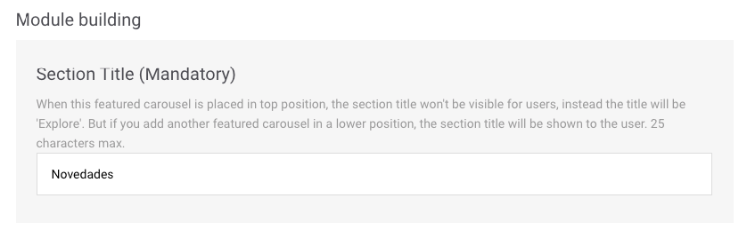

# FAQs

### Can a module be in several layouts at the same time?

Yes, absolutely. It is therefore worth bearing in mind that the changes you make to a module can affect several layouts.

When editing a module, you can see which layout or layouts it is included in:

### I only want to change one detail of a module for one layout but that module is also in use in another layout; what can I do?

If you only want that change to affect one layout then create another identical module that also includes the detail you wish to modify. You will then have created two modules. Use the module you need in each layout.


For example

_I have the layouts **Layout android prepay** y **Layout ios prepay**. Both layouts contain the **Rows Club Movistar** module:_

_I have decided that some of the information I wish to display about the price is not the same for Android as it is for iOS._

_What should I do?_

In this case, you need to create a new module. Call it, for example, _Club Movistar iOS_. The configuration will be the same as the module you already had \(_Club Movistar_\) but with modified pricing information for iOS, just as you wanted.

Then, once you have created this module, go to the layout repository and edit **Layout ios prepay**. Delete the **Row Club Movistar** module and add the new **Row Club Movistar iOS** module that you have created.



Remember to put the modules in the order you wish them to appear, taking into account the fact that the new module you have created will appear last.


### I have made a change to a module and I want to publish it. Where do I do this from?

The fact is that you publish the layout rather than the modules. The reason for this is simple: a change to a module can affect several layouts at the same time and that may not be your intention. That is why you always publish layouts.

🎯 Don't know how to publish a layout? This will be of interest to you👇



### I have made changes to a layout but I have not yet published them. Can I preview the changes before making them visible to all users?

Yes, of course you can do it. Click on this link👇



### I want to create a new layout; how do I do it?

You cannot create a new layout as the layouts are already configured depending on the segmentation of your customers. Remember, operating system, payment model.

### I want to use a _Featured Content_ module but I would like it to be seen after another module that I had created. Is it possible to place it in any position?

Of course. You can place it in any position you want within the layout. Of course, bear in mind that the title shown in this case is the one you defined in the **Section Title** field.


Bear in mind that a _Featured Content_-type module must always occupy the first position, regardless of whether you use more of this type in your layout composition.


I don't have a username to log in to Explore CMS, how do I get one?

Contact your NOVUM team directly. They will manage your login.

