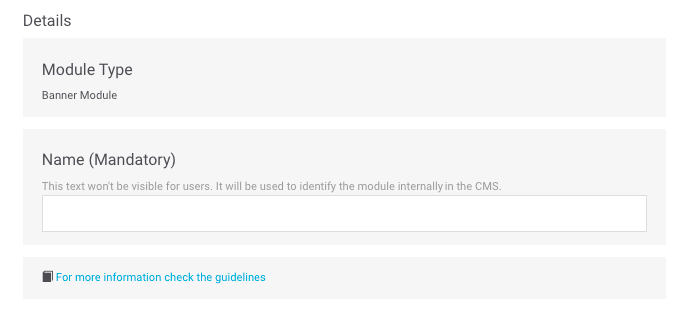
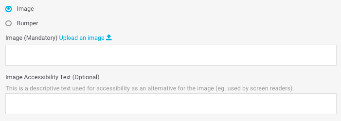
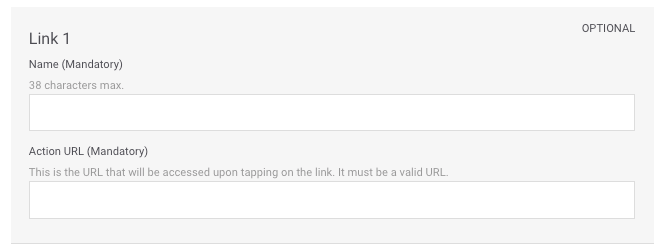

# Banner + links

_Banner_ modules simply contain an image or a _bumper_ with a link.

💡 **Did you know?**

A _bumper_ is a short video or animation. It is a fairly standard format used in marketing, usually used for commercial purposes and with an average duration of around 6 seconds.

Fill in the required fields and decide if you need to fill in any of the optional fields:

## Details

**Name**. Name that internally identifies the element. It is never shown in the app but you can use this name to identify the module in the module list view.‌

​​🔅 It has no maximum length and is a **required** field.‌

**For more information check the guidelines**. Check the design guidelines relating to the module you are creating or editing. Review them to ensure that content of the highest possible quality is being uploaded.

## Module building

### Banner

For each _banner_, the available fields will vary depending on whether you select an image or a _bumper_:

* **Image**. It displays a static image.
* **Bumper**. It displays a short video or animation.




**Image Upload an image** 📤. URL of the _banner_ image. This must be in the CMS's own URL format.

Click on the **Upload an image** link 📤 _\*\*_ and choose the image you want from your computer. Once the image upload has been processed, the URL will autocomplete in the text field.

When the image has been uploaded it is previewed just below.

🔅 This is a **required** field.

**Image Accessibility Text**. Description of the image that is used for accessibility as an alternative if the image cannot be displayed \(for example, for people with vision problems\).

🔅 It has no maximum length and is an **optional** field.




**Bumper Upload a bumper** 📤. It is auto-filled with the name of the _bumper_.

To upload a bumper you have two options:

1. Click on the **Upload a bumper** 📤 link and upload a _bumper_ from your computer.
2. Display the list of _bumpers_ and select one of those that have already been uploaded.

Activate the **Play in loop** option ifor the _bumper_ to be played in loop in Explore. If you leave it off, it will play every time the _bumper_ is on the screen, but once it has finished it will stop.

When the _bumper_ has been uploaded it is previewed just below:

**Bumper Accessibility Text**. Description of the _bumper_ that is used for accessibility as an alternative if the _bumper_ cannot be displayed \(for example, for people with vision problems\).

🔅 It has no maximum length and is an **optional** field.



**Action URL**. URL of the _banner_, i.e., the URL that can be accessed by clicking on the _banner_.

🔅 This is a **required** field and has to be a valid URL \(for example: [`https://www.google.com`](https://www.google.com)\)

**Card Starting date and time**. Date and time you want the _banner_ to start being displayed to users.

🔅 It is an optional field.

**Card Ending date and time**. Date and time you want the _banner_ to stop being displayed to users.

🔅 It is an optional field.

**Card Microsegments**. Tags that you can add, always separated by commas, to make a segmentation of the users who are going to see the content you are creating.

### Link

You can choose to add links at the bottom of the _banner_. In order to do so, fill in the following fields for each link you want to add \(up to a maximum of 5 links\):

**Name**. Name of the link \(for example `Benefits`\).

🔅 It has a maximum length of **38 characters** and is a **required** field.

**Action. URL** that opens when you click on the **Name**, i.e., on the name of the link.

🔅 This is a required field and has to be a valid URL \(for example: [`https://www.google.com`](https://www.google.com)\)

**Card 1 categories \(mandatory\)**

Categories allow you to filter content in Explore. The categories are shown at the top in a horizontal scroll bar, which allows the user to browse by category and choose the one they want to see.

When the user selects a category, the content is shown in a vertical format \(as opposed to having to scroll horizontally\), so that the user doesn't miss any content.

In Explore CMS, select the category or categories that apply to the card that you are configuring:

* **Accessories**: earphones, cases, watches.
* **Devices**: smartphones, tablets.
* **O2 Priority**: membership, loyalty/retention programmes content \(Vivo Valoriza, Priority, Club Movistar, etc.\)
* **Promotions**: promotional content that may apply and which may coexist with other categories.
* **Perks**: rates, plan upgrades.
* **O2 Extra's**: added value services, apps, new app features, other TEF services.


The category **All**, which is the first one that you see, isn't a category as such. Rather, it is the way in which the user can view all the content.

By default, when a user opens Explore he/she sees all content and all configured cards. As such, the selected category is always **All**.


🎯 **Good practices**: We don't recommend assigning more than one category to a content. Explore CMS does not set a limit for the number of categories that can be assigned.

**What should I consider when using the categories?**

Consult the [**Categories**](../../faq_en-us.md#categories) section of the [FAQ](../../faq_en-us.md) to resolve all of your doubts.

