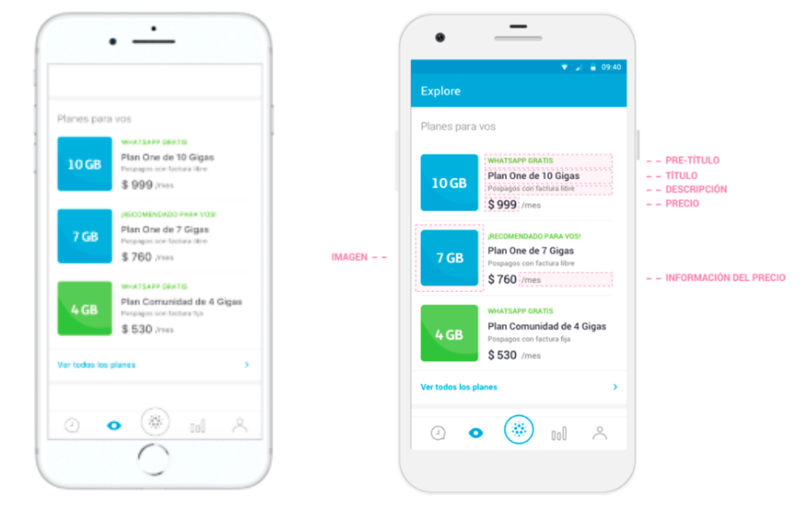
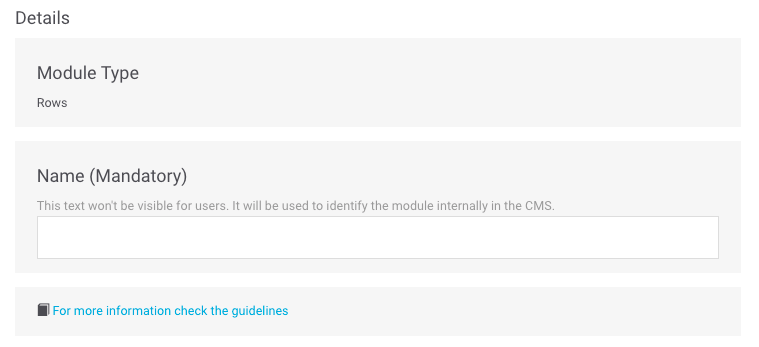
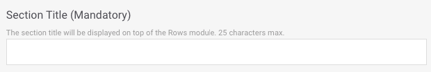
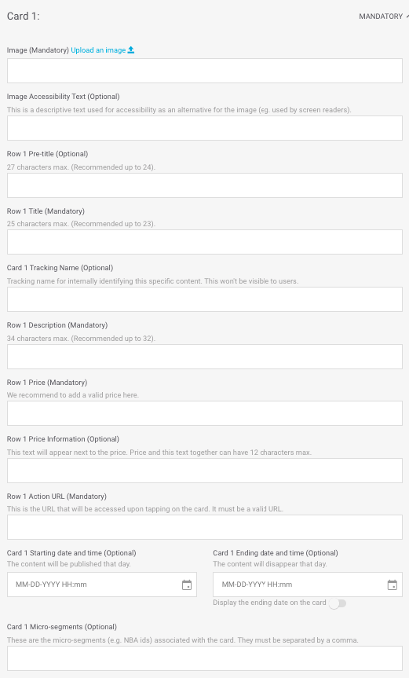

# Rows

This type of module is really geared towards presenting different tariffs to users although you can use it for any content that fits.

It is formatted in rows \(_rows_\) where each row has several optional fields such as a small tag that acts as a title for that row, a short text and its corresponding link.

Fill in the required fields and decide if you need to fill in any of the optional fields:

## Details

**Name**. Name that internally identifies the element. It is never shown in the app but you can use this name to identify the module in the module list view.‌

​🔅 It has no maximum length and is a **required** field.‌

**For more information check the guidelines**. Check the design guidelines relating to the module you are creating or editing. Review them to ensure that content of the highest possible quality is being uploaded.

## Module building

**Section Title**. Title shown above the module. In addition, this title is used to internally identify the module you are creating. Using this title, you can identify the module in the module list view.

🔅 It has a maximum length of **25 characters** and is a **required** field.

## Cards

Configure a minimum of 2 rows and a maximum of 3. For each row, the available fields are:

**Row 1 Image URL - Upload an image** 📤. URL of the row image. This must be in the CMS's own URL format.

Click on the **Upload an image** link 📤 and choose the image you want from your computer. Once the image upload has been processed, the URL will auto-complete in the text field.

When the image has been uploaded it is previewed just below.

​​🔅 It has no maximum length and is a **required** field.‌

**Row 1 Image Accesibility Text**. Description of the image that is used for accessibility as an alternative if the image cannot be displayed \(for example, for people with vision problems\).

🔅 It has no maximum length and is an **optional** field.

**Row 1 Pre-title**. Small highlighted text prior to the title \(for example `30 DAYS FREE`\).

🔅 It has a maximum length of **27 characters** \(less than 24 recommended\) and is an **optional** field.

**Row 1 Title**. Title of the offer/plan that appears next to the image \(for example: `BIG 20 Gigas Plan`\).

🔅 It has a maximum length of **25 characters** \(less than 23 recommended\) and is a **required** field.

**Card 1 Tracking Name**. Name that is not seen by users but is seen in Google Analytics. It is used to more easily identify the product internally.

🔅 It is an **optional** field.

**Row 1 Description**. Brief description of the product presented. The description is shown below the title.

🔅 It has a maximum length of **34 characters** \(less than 32 recommended\) and is a **required** field.

**Row 1 Price**. Price that is shown below the description, next to the image. Remember to always specify a valid price \(for example `$123`\)

It has no maximum length and is a **required** field.

**Row 1 Price Information**. Text to provide additional information about the price. It is shown next to the price, with a more discreet style and preceded by `/` \(for example `per month`\).

🔅It has a maximum length of **12 characters** \(these characters also include the **Row 1 Price** \) and is an **optional** field.

**Row 1 Action Url**. URL of the row, i.e., the URL that can be accessed by clicking on the row.

🔅 This is a **required** field and has to be a valid URL \(for example: [`https://www.google.com`](https://www.google.com)\)

**Card 1 Starting date and time**. Date and time you want the _row_ to start being displayed to users.

🔅 It is an optional field.

**Card Ending date and time**. Date and time you want the _row_ to stop being displayed to users.

🔅 It is an optional field.

**Display the ending date on the card**. Activate this option to inform the user that the content will expire.

**How is the expiration date displayed?**

If you have enabled the option to show the expiration date, the way in which that date is displayed depends on the day on which the _card_ expires.

`ENDS TODAY hh:mm AM` or `ENDS TODAY hh:mm PM` or `ENDS TODAY hh:mm` \(format varies depending on the country\) to indicate that _card_ expires on the same day at the specified time, in the morning or in the afternoon, respectively. For example, `ENDS TODAY at 9:00 AM`.

`TOMORROW` indicates that the expiration date is the following day.

`ENDS on dd mm` to indicate that the difference is more than two days. For example `ENDS on 30 JUN`.

🎯 Starting and Ending date and time is a way to program some campaigns and is specifically designed for seasonal campaigns.

**Card 1 Micro-segments**. Tags that you can add, always separated by commas, to make a segmentation of the users who are going to see the content you are creating.

🔅 It is an **optional** field.

**Card 1 categories \(mandatory\)**

Categories allow you to filter content in Explore. The categories are shown at the top in a horizontal scroll bar, which allows the user to browse by category and choose the one they want to see.

When the user selects a category, the content is shown in a vertical format \(as opposed to having to scroll horizontally\), so that the user doesn't miss any content.

In Explore CMS, select the category or categories that apply to the card that you are configuring:

* **Accessories**: earphones, cases, watches.
* **Bundles**: packs, plans, product packs.
* **Devices**: smartphones, tablets.
* **Loyalty**: membership, loyalty/retention programmes content \(Vivo Valoriza, Priority, Club Movistar, etc.\)
* **Promos**: promotional content that may apply and which may coexist with other categories.
* **Plans**: rates, plan upgrades.
* **Services**: added value services, apps, new app features, other TEF services.
* **TV**: television plans, content packs, featured or new content.


The category **All**, which is the first one that you see, isn't a category as such. Rather, it is the way in which the user can view all the content.

By default, when a user opens Explore he/she sees all content and all configured cards. As such, the selected category is always **All**.


🎯 **Good practices**: We don't recommend assigning more than one category to a content. Explore CMS does not set a limit for the number of categories that can be assigned.

**What should I consider when using the categories?**

Consult the [**Categories**](../../faq_en-us.md#categories) section of the [FAQ](../../faq_en-us.md) to resolve all of your doubts.

