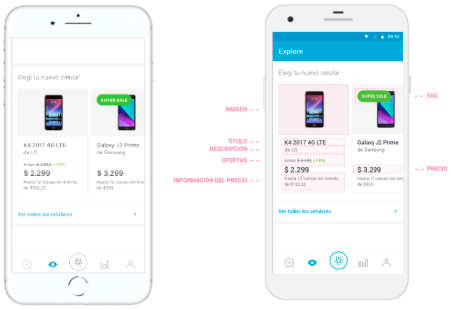
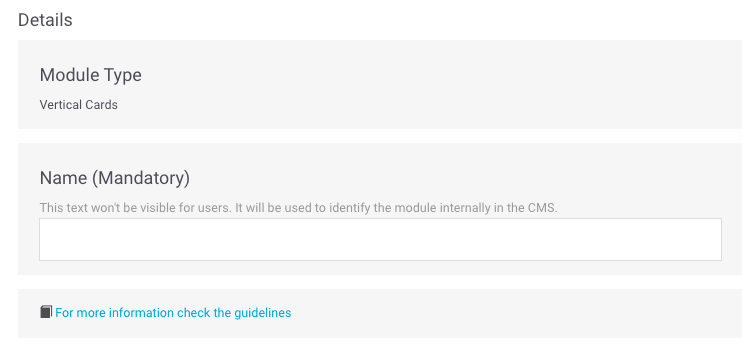
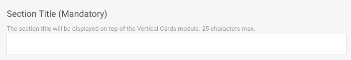
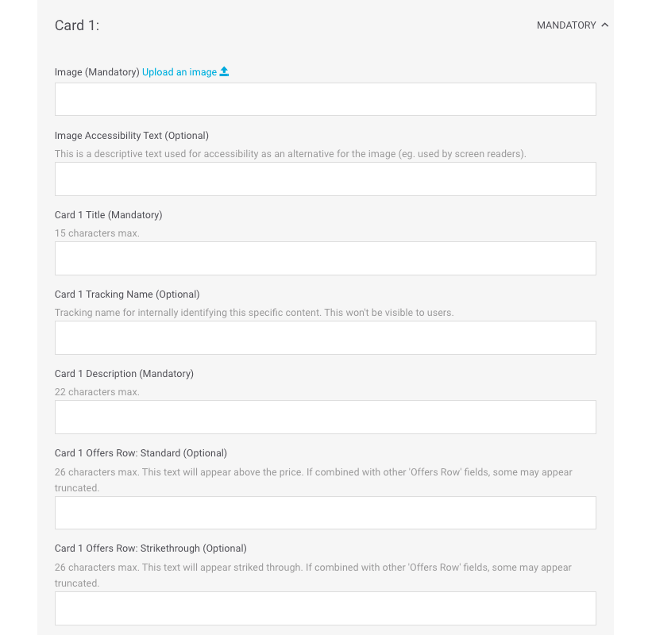
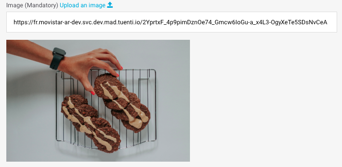
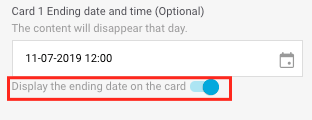
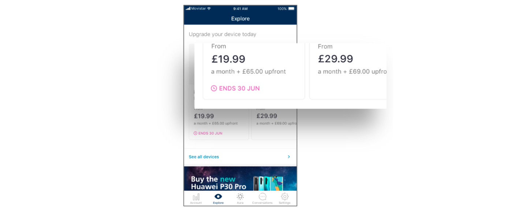
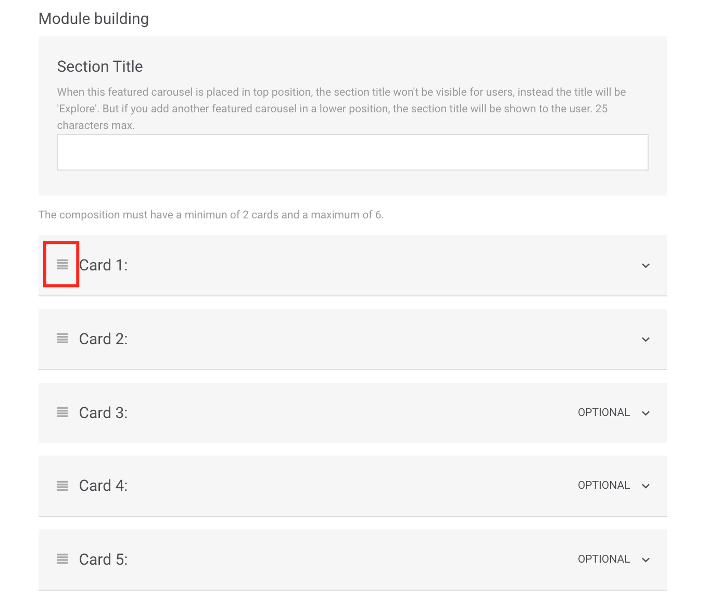
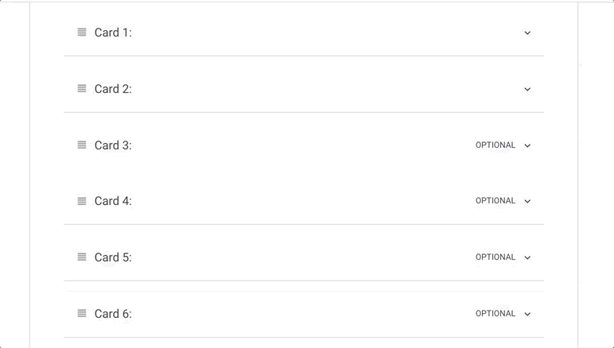
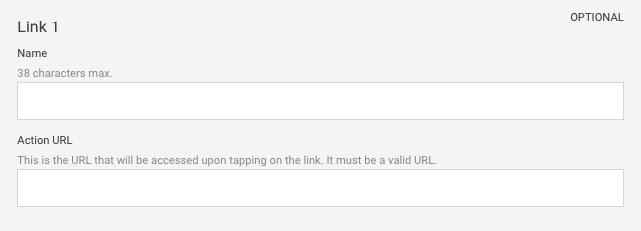

# Vertical Cards

This type of module is used to display several elements in vertical format. It is very useful for presenting products offers, for example.

It is displayed as a carousel offering links on each _card_ as well as optional elements like a tag on the image or a link to an entire list \(a "See all"\).

Fill in the required fields and decide if you need to fill in any of the optional fields:

## Details

**Name**. Name that internally identifies the element. It is never shown in the app but you can use this name to identify the module in the module list view.

​​🔅 It has no maximum length and is a **required** field.‌

**For more information check the guidelines**. Check the design guidelines relating to the module you are creating or editing. Review them to ensure that content of the highest possible quality is being uploaded.

## Module building

**Section Title**. Title shown above the module. In addition, this title is used to internally identify the module you are creating. Using this title, you can identify the module in the module list view.

🔅 It has a maximum length of **25 characters** and is a **required** field.

## Cards

The _cards_ are the sections that make up the carousel. For each _Vertical cards_ module, configure a minimum of 2 _cards_ and a maximum of 6.

For each _card_, the available fields are:

**Card 1Image - Upload an image** 📤. URL of the _card_ image. This must be in the CMS's own URL format.

Click on the **Upload an image** link 📤 and choose the image you want from your computer. Once the image upload has been processed, the URL will autocomplete in the text field.

When the image has been uploaded it is previewed just below.

🔅 It has no maximum length and is an **optional** field.

**Card 1 Image Accesibility Text**. Description of the image that is used for accessibility as an alternative if the image cannot be displayed \(for example, for people with vision problems\).

​​🔅 It has no maximum length and is a **required** field.‌

**Card 1 Title**. Title of the card that appears below the image. In addition, it identifies the card internally \(for example: `iPhone X`\).

🔅It has a maximum length of **15 characters** and is a **required** field.

**Card 1 Tracking Name**. Name that is not seen by users but is seen in Google Analytics. It is used to more easily identify the product internally.

🔅 It is an **optional** field.

**Card 1 Description**. Short description of the product shown \(for example: `by Apple`\).

🔅 It has a maximum length of **22 characters** and is a **required** field.

**Card 1 Offers Row** : **Standard**. Text that is displayed about the price of the _card_ , with a normal style \(for example: `From`\). When combined with other **Offers Row** fields, the last fields may be affected if you use all available fields.

🔅It has a maximum length of **26 characters** and is an **optional** field.

**Card 1 Offers Row: Highlight**. Text that is displayed about the price of the _card_ , with a highlighted style \(for example: `-18%`\). When combined with other **Offers Row** fields, the last fields may be affected if you use all available fields.

🔅It has a maximum length of **26 characters** and is an **optional** field.

Here is a set of examples of combinations of **Offers Row** fields:

**Row 1 Price**. Price that is shown below the title and description. Remember to always indicate a valid price \(for example `$123`\).

​​🔅 It has no maximum length and is a **required** field.‌

**Row 1 Price Information**. Text to provide additional information about the price and which is shown below. Depending on the number of characters, it takes up one or two lines \(for example `Up to 12 months interest-free`\).

🔅It has a maximum length of **52 characters** and is an **optional** field.

**Card 1 Tag**. Short text that is located above the image of the _card_.

🔅 It has a maximum length of **18 characters** \(less than 10 recommended\) and is a **optional** field.

**Card 1 Action Url**. URL of the _card_, i.e., the URL that can be accessed by clicking on the _card_.

🔅 This is a **required** field and has to be a valid URL \(for example: [`https://www.google.com`](https://www.google.com)\)

**Card 1 Starting date and time**. Date and time you want the _card_ to start being displayed to users.

🔅 It is an optional field.

**Card 1 Ending date and time**. Date and time you want the _card_ to stop being displayed to users.

🔅 It is an optional field.

**Display the ending date on the card**. Activate this option to inform the user that the content will expire.

**How is the expiration date displayed?**

If you have enabled the option to show the expiration date, the way in which that date is displayed depends on the day on which the _card_ expires.

`ENDS TODAY hh:mm AM` or `ENDS TODAY hh:mm PM` or `ENDS TODAY hh:mm` \(format varies depending on the country\) to indicate that _card_ expires on the same day at the specified time, in the morning or in the afternoon, respectively. For example, `ENDS TODAY at 9:00 AM`.

`TOMORROW` indicates that the expiration date is the following day.

`ENDS on dd mm` to indicate that the difference is more than two days. For example `ENDS on 30 JUN`.

🎯 Starting and Ending date and time is a way to program some campaigns and is specifically designed for seasonal campaigns.

**Card 1 Micro-segments**. Tags that you can add, always separated by commas, to make a segmentation of the users who are going to see the content you are creating.

🔅 It is an **optional** field.


Remember that you have to configure a minimum of 2 cards and a maximum of 6.

The fields for all the cards are the same.


**Card 1 categories \(mandatory\)**

Categories allow you to filter content in Explore. The categories are shown at the top in a horizontal scroll bar, which allows the user to browse by category and choose the one they want to see.

When the user selects a category, the content is shown in a vertical format \(as opposed to having to scroll horizontally\), so that the user doesn't miss any content.

In Explore CMS, select the category or categories that apply to the card that you are configuring:

* **Accessories**: earphones, cases, watches.
* **Devices**: smartphones, tablets.
* **O2 Priority**: membership, loyalty/retention programmes content \(Vivo Valoriza, Priority, Club Movistar, etc.\)
* **Promotions**: promotional content that may apply and which may coexist with other categories.
* **Perks**: rates, plan upgrades.
* **O2 Extra's**: added value services, apps, new app features, other TEF services.


The category **All**, which is the first one that you see, isn't a category as such. Rather, it is the way in which the user can view all the content.

By default, when a user opens Explore he/she sees all content and all configured cards. As such, the selected category is always **All**.


🎯 **Good practices**: We don't recommend assigning more than one category to a content. Explore CMS does not set a limit for the number of categories that can be assigned.

**What should I consider when using the categories?**

Consult the [**Categories**](../../faq_en-us.md#categories) section of the [FAQ](../../faq_en-us.md) to resolve all of your doubts.

### Change the order of the _cards_

Inside the module, you can move the cards to change the order in which they are displayed.

To move a _card_, simply drag it to the place where you want it to be displayed and release.

### Link

You can choose to add links that will be shown at the bottom of the module.

In order to do so, fill in the following fields for each link you want to add \(up to a maximum of 5 links\):

**Name**. Name of the link \(for example `Benefits`\).

🔅 It has a maximum length of **38 characters** and is a **required** field.

**Action URL.** Link that opens when you click on the ​**Name**, i.e., on the name of the link.

🔅 This is a required field and has to be a valid URL \(for example: [`https://www.google.com`](https://www.google.com)\)

