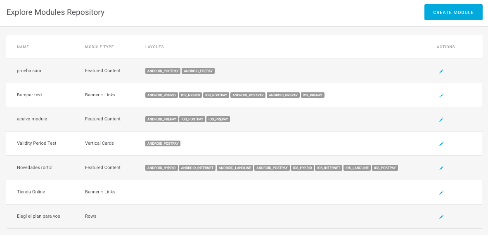
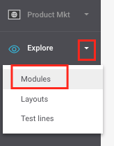

# Modules repository

The [modules](https://github.com/iciaparicio/explore-cms-en/tree/198951b25143b278fbda54020e437607733b235b/modulo/README.md) repository is the list of all the modules created. From the modules repository, you can edit an existing module or create a new one.

Access from the side menu **Explore &gt; Modules**.

